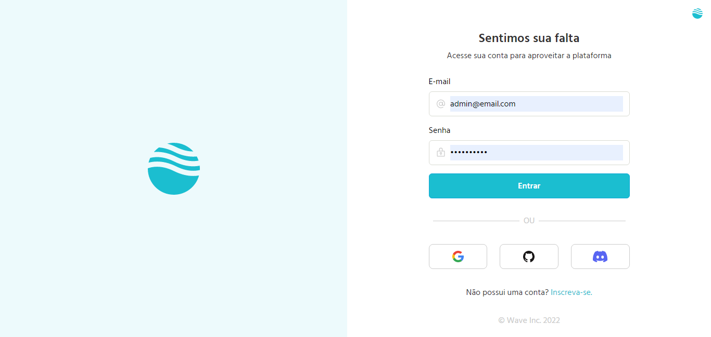

<div align="center">
  
  <h3>Sistema de autenticação desenvolvido sem bibliotecas.</h3>
</div>

## 📃 Sobre

<br />

O Wavy é o projeto que demonstra como realizar dois tipos de autenticação em uma aplicação web, que são:

- Autenticação social
- Autenticação tradicional (e-mail e senha)

Este projeto foi desenvolvido sem o auxílio de bibliotecas que ajudam no processo de autenticação social, como a lib passport.js por exemplo. Você encontrará tanto autenticação com provedores populares (google, github e discord), como com e-mail e senha apenas.

## 💻 Principais Tecnologias utilizadas no projeto

Este projeto utiliza diversas tecnologias bem legais e úteis que você talvez possa gostar e utilizar em alguns projetos.

- [Vite](https://vitejs.dev/)
- [React](https://pt-br.reactjs.org/)
- [Typescript](https://www.typescriptlang.org/)
- [Axios](https://axios-http.com/ptbr/docs/intro)
- [Phosphor-icons](https://phosphoricons.com/)
- [React-hook-form](https://react-hook-form.com/get-started/)

## Funcionalidades

Este projeto possui diversas funcionalidades úteis em um blog que você pode conferir logo abaixo:

- Criação de conta com e-mail e senha.

- Criação de conta com google.

- Criação de conta com github.

- Criação de conta com discord.

- Login com e-mail e senha

- Login com provedores de autenticação

- Logout

## Como executar o projeto na sua máquina

<br />

Para executar o projeto você terá de seguir os passos listados abaixo. 

Primeiro clone o repositório do projeto com o comando:

<br />

```bash
git clone git@github.com:henrique998/Wavy-Web.git
```

Execute um dos comando abaixo para instalar as dependências do projeto:

```bash
npm install
# OU
yarn install
```

<br />

Agora está tudo pronto para iniciar o projeto. execute o comando abaixo para iniciar o servidor:

<br />

```bash
npm run dev
# OU
yarn dev
```

## Aviso

<br />

**Passo Importante**: Este projeto depende de uma api desenvolvida em node.js por mim também. Então clone a api abaixo, e siga o passo a passo para executá-la em sua máquina. você pode conferir mais detalhes em: 

- [Wavy-api](git@github.com:henrique998/Wavy-Api.git)

## Contato

<br />

Entre em contato comigo por email ou no linkedin:

- henriquemonteiro037@gmail.com
- [linkedin](https://www.linkedin.com/in/henrique-monteiro1/)